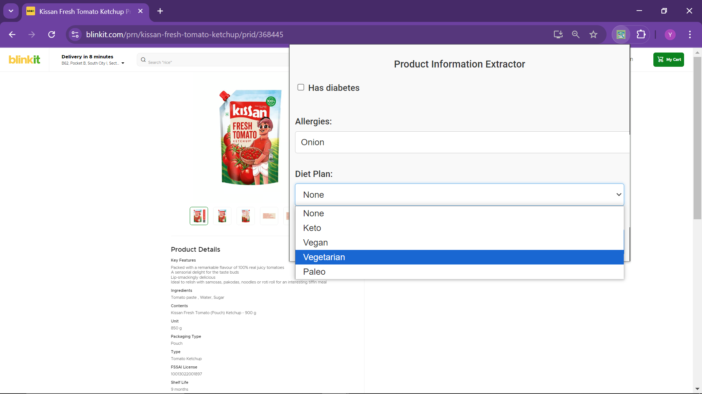
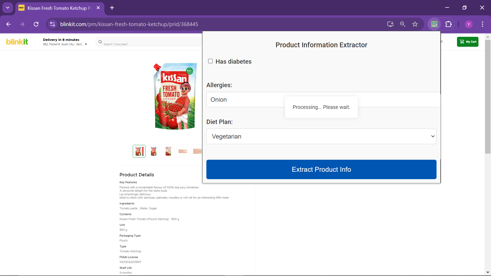

# NutriNudge - Browser Extension for Food Product Health Analysis


## Overview

**NutriNudge** is a browser extension designed to help users make informed food choices by providing detailed health analyses of packaged food products. The extension scans product pages and uses AI-powered analysis to provide insights on nutritional value, harmful ingredients, allergen information, and suitability for specific dietary preferences like vegetarian or diabetes-friendly diets. The goal of NutriNudge is to empower consumers to understand the impact of their food choices on health in a simple and user-friendly way.

## Features

- **Nutritional Analysis**: Understand the nutritional content of packaged food items with easy-to-read labels showing high and low nutrient levels.
- **Health Impact**: Detailed analysis of ingredients and processing levels, highlighting harmful substances.
- **Dietary Preferences**: Provides insights for special dietary needs, such as diabetes, allergies, and vegetarian options.
- **OpenFoodFacts Integration**: Uses OpenFoodFacts API to fetch information not available directly on product pages.
- **Gemini AI Integration**: Uses the Gemini model for generating a health analysis report.

## How It Works

1. It is yet to be deployed, but you can run it locally.
2. Navigate to any product page (currently supported on Blinkit).
3. Click on the **NutriNudge** icon to activate the extension.
4. Enter your dietary preferences (e.g., diabetes, specific allergies).
5. The extension will analyze the product information, generate insights, and display the results in an easy-to-read format.

## Installation & Local Setup

To test NutriNudge locally:

### Prerequisites

- **Node.js** and **npm** installed.
- **Google Chrome** for loading the extension.

### Backend Setup

1. Clone the repository:
   ```bash
   git clone https://github.com/your-username/nutrinudge.git
   ```
2. Navigate to the project directory:
   ```bash
   cd nutrinudge
   ```
3. Install the necessary Node.js dependencies:
   ```bash
   npm install
   ```
4. Start the backend server:
   ```bash
   node server.js
   ```

### Extension Setup

1. Open **Google Chrome** and navigate to `chrome://extensions/`.
2. Enable **Developer mode** in the top right corner.
3. Click on **Load unpacked** and select the `nutrinudge` extension directory.

### Running the Extension

1. Ensure the **backend server** is running (`node server.js`).
2. Navigate to a supported product page (e.g., Blinkit).
3. Click on the **NutriNudge** extension icon in your browser.
4. Enter your preferences and click **Analyze**.
5. The extension will display the product analysis.

## Usage

- Visit a supported product page.
- Click the **NutriNudge** icon in your browser toolbar.
- Enter your preferences and click **Analyze**.
- View the health insights, including high and low nutrients, harmful ingredients, and allergen warnings.

## Screenshots

Below are some screenshots of the **NutriNudge** extension in action:

1. **Main Extension Interface**:
   

2. **Loading Screen**:
   

3. **Product Analysis Results**:
   

## Technologies Used

- **JavaScript**: For DOM manipulation and handling events.
- **HTML/CSS**: For designing the extension's popup and modal interface.
- **Node.js/Express**: For backend support and integration with Gemini AI.
- **Google Generative AI (Gemini Model)**: To provide health-related insights.
- **OpenFoodFacts API**: To fetch nutritional information for products.


## Future Opportunities

- **Multi-Platform Support**: Extend support for other popular grocery platforms such as BigBasket and Swiggy Instamart.
- **Mobile Plugin**: Develop a mobile app version to analyze products in mobile grocery apps.
- **UI Enhancement**: Directly update product pages with health information to provide an in-context view for users.
- **Personalized Recommendations**: Provide users with healthier alternative products based on their preferences.

## Challenges Faced

- **Handling Missing Product Information**: Some product pages lacked necessary details, which led us to use OpenFoodFacts API to fill in the gaps.
- **CORS Issues with APIs**: Faced challenges related to cross-origin requests during integration with external APIs.
- **JavaScript Parsing**: Parsing raw output from the Gemini AI required careful sanitization, including removing unwanted JSON markers like backticks.

## Contributing

Feel free to submit a pull request to suggest improvements or fix any issues.

**NutriNudge** is here to make informed food decisions easier. Know what you eat, and stay healthy! 🚀